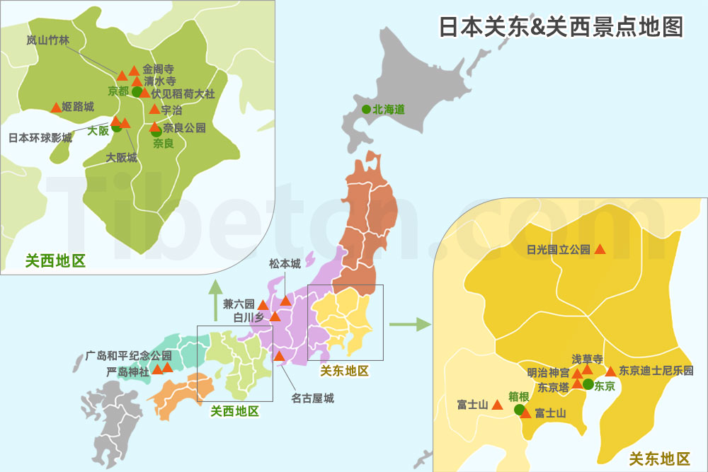
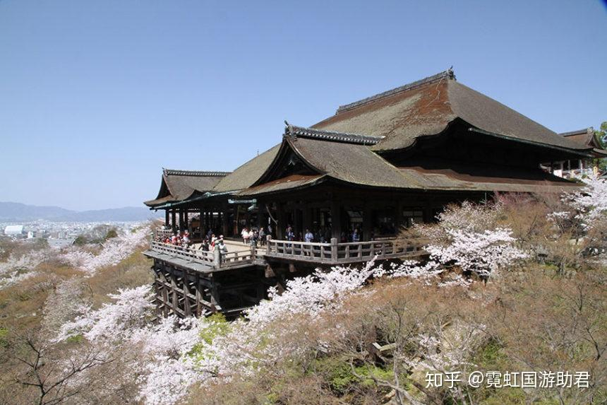
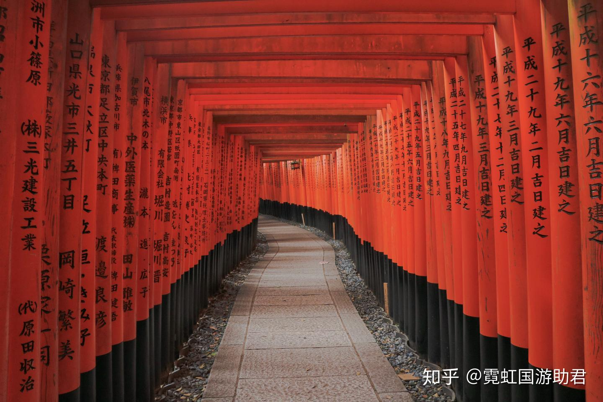
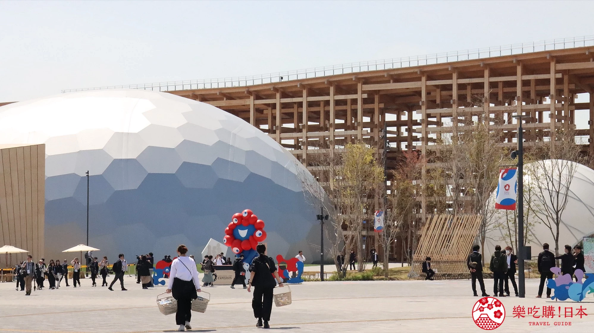
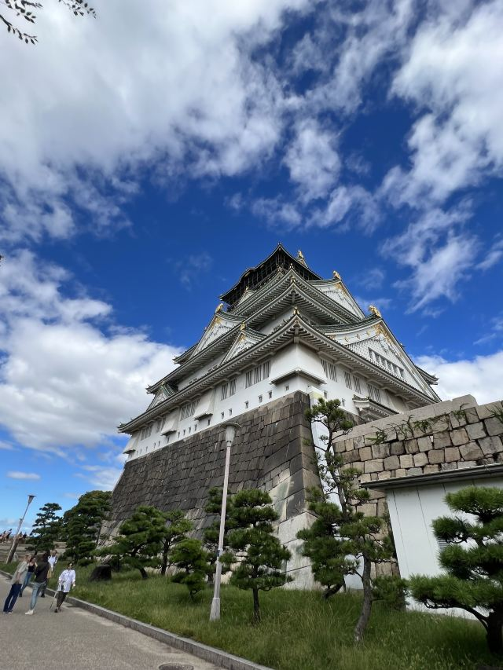
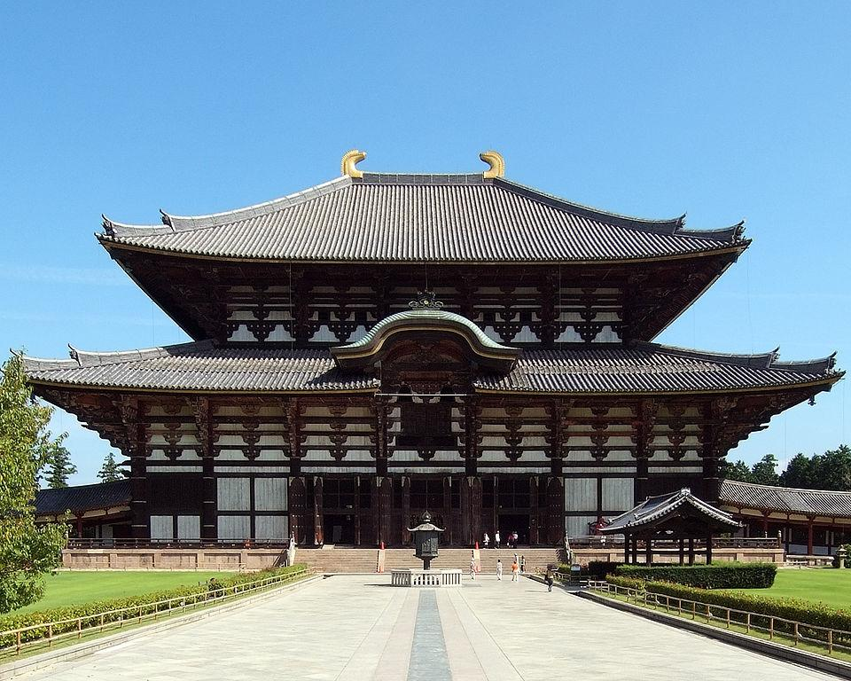
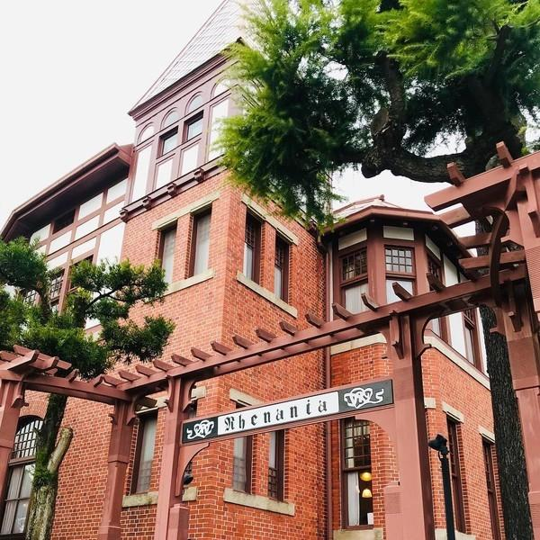

# 日本旅游地点梳理

## 关西地区

代表城市：京都、大阪、奈良、神户

> 如果你向往的是古寺、艺妓、怀石料理这些充满古韵的日本符号，关西会像一个活的历史画卷在你面前展开。

**推荐景点与特色：**

1. **京都：古都的灵魂**

   - **清水寺:** 京都最负盛名的古刹之一，以寺内悬空的木构清水舞台而出名，里面有各式风格不同的建筑、千手观音像、祈祷泉等。
   - **伏见稻荷大社**：祈求商业繁荣和五谷丰登的圣地。伏见稻荷大社的千本鸟居可以说是京都的代名词，赤红的鸟居从山脚一路建造至山顶，如果只是想打卡鸟居不必爬到山顶。另外伏见稻荷大社的守护神是狐狸所以无论是社内的雕像还是写下心愿用的绘马，都采用了狐狸的造型非常独特。
   - **岚山竹林：**以秀丽壮美的竹林景色而闻名，漫步在由高耸翠竹形成幽静通道中，可聆听竹梢摇曳的自然之声。整个 岚山 景区很大，适合放慢节奏慢慢逛
   - **三千院**：院子里古树参天，满地绿色苔藓。春天抹茶绿，夏天无尽夏绣球花。
   - **琉璃光院**：每年仅春秋开放两次，這座古老的院落，曾是貴族的私人別墅，後來成為僧侶的修行之所，如今已向公眾開放，展現了歷史與自然之美的完美融。需提前预约（门票2000日元）。
   - **伊根舟屋**：被称为“日本威尼斯”，230间江户时代木造舟屋临海而立，可住一晚体验渔村晨昏。

   > [京都自由行景点36选：清水寺、金阁寺、伏见稻荷＋美食伴手礼推荐 | 乐吃购！日本 关西版](https://osaka.letsgojp.cn/archives/548388/)

2. **大阪：美食与活力的现代都会**

   - **世界博览会（大阪万博）**：展期从2025年4月13日（日）起至2025年10月13日（一）为止
   - **大阪城公园**：天守阁是参观重点，可登顶俯瞰大阪全景。其建于战国时期，是城主的居住之所，也是军事瞭望塔，最早是丰臣秀吉所建。
   - **道顿堀 & 心斋桥**：心斋桥筋商店街从心斋桥站延伸 1,000 多米直至道顿堀，是日本最繁忙、最古老的商店街之一。道顿堀的街道巷弄里遍布着居酒屋、餐厅及酒吧。这里的螃蟹餐厅相当有名，您也可以尝试大阪风格的寿司。许多大型餐厅都提供英文菜单
   - **日本环球影城（USJ）**：可分为「超级任天堂世界™」、「哈利波特的魔法世界™」、「纽约」、「好莱坞」、「小小兵乐园」、「旧金山」、「侏罗纪公园」、「亲善村」、「水世界」与「环球奇境」等10大园区。

3. **奈良：与自然和神灵对话**

   - **奈良公园**：奈良必去的观光景点大多都位在奈良公园内，如：东大寺、春日大社、兴福寺、若草山以及奈良博物馆。园内的鹿约有1,400头，数量众多，由于鹿完全不怕人，去的时候可以和路边的小贩买些鹿仙贝，绝对可以吸引一大群鹿前来讨食。
   - **东大寺**：是日本早期最大的佛教建筑之一，更是现今世界上最大的木造结构建筑。
   - **春日大社**：春日大社是奈良公园境内的神社，和东大寺并列奈良重要的文化财产，其历史悠久也被世界教科文组织列为世界文化遗产。除了醒目的朱红色建筑，其境内约有三千多个石灯笼，顺着通往神社的路上两字排开。

   > [日本奈良旅游15个必去景点,别只知道看小鹿! - 知乎](https://zhuanlan.zhihu.com/p/100336730)

4. **神户**：**拥有最昂贵的牛肉**

   - **有马温泉**：有名的温泉小镇，坐落于神户市郊的六甲山山麓中。关西地区最古老的温泉，与下吕温泉、草津温泉并称日本三大名泉
   - **北野异人馆街**：异人就是外国人，异人馆实际上就相当于我们的法租界、英租界一样，是当年洋人聚集地，所以这里都是西洋建筑的集合，包括了风见鸡之馆、萌黄之馆等，零零散散，有点像广州的沙面，外面走走拍拍照很有异域风情。
   - **神户牛肉**：神户牛可能是世界上最贵的和牛，取自兵库县的黑毛但马牛，与近江牛、松阪牛并称三大和牛，但因为产量低而更受追捧，来自食客的需求导致神户牛出不了兵库县就被吃光了

## 关东地区

代表城市：东京、横滨、镰仓、箱根、日光

> 如果你期待的是东京塔夜景、富士山、主题乐园、买手店和美术馆，关东的多元感会给你更丰富的旅行层次。